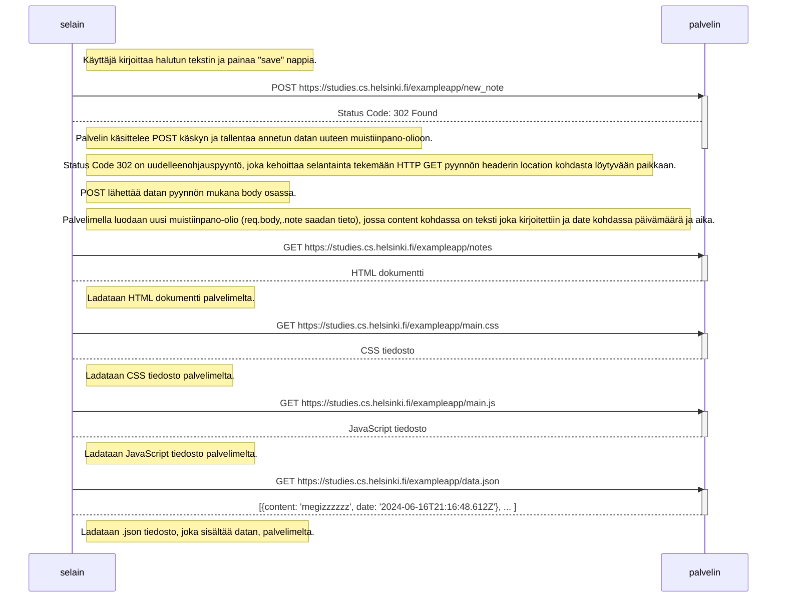

```mermaid
sequenceDiagram
    participant selain
    participant palvelin

    Note right of selain: Käyttäjä kirjoittaa halutun tekstin ja painaa "save" nappia.

    selain->>palvelin: POST https://studies.cs.helsinki.fi/exampleapp/new_note
    activate palvelin
    palvelin--> selain: Status Code: 302 Found
    Note right of selain: Palvelin käsittelee POST käskyn ja tallentaa annetun datan uuteen muistiinpano-olioon.
    deactivate palvelin
    Note right of selain: Status Code 302 on uudelleenohjauspyyntö, joka kehoittaa selantainta tekemään HTTP GET pyynnön headerin location kohdasta löytyvään paikkaan.
    Note right of selain: POST lähettää datan pyynnön mukana body osassa.
    Note right of selain: Palvelimella luodaan uusi muistiinpano-olio (req.body,.note saadan tieto), jossa content kohdassa on teksti joka kirjoitettiin ja date kohdassa päivämäärä ja aika.

    selain->>palvelin: GET https://studies.cs.helsinki.fi/exampleapp/notes
    activate palvelin
    palvelin--> selain: HTML dokumentti
    deactivate palvelin
    Note right of selain: Ladataan HTML dokumentti palvelimelta.

    selain->>palvelin: GET https://studies.cs.helsinki.fi/exampleapp/main.css
    activate palvelin
    palvelin--> selain: CSS tiedosto
    deactivate palvelin
    Note right of selain: Ladataan CSS tiedosto palvelimelta.

    selain->>palvelin: GET https://studies.cs.helsinki.fi/exampleapp/main.js
    activate palvelin
    palvelin--> selain: JavaScript tiedosto
    deactivate palvelin
    Note right of selain: Ladataan JavaScript tiedosto palvelimelta.
    
    selain->>palvelin: GET https://studies.cs.helsinki.fi/exampleapp/data.json
    activate palvelin
    palvelin--> selain: [{content: 'megizzzzzz', date: '2024-06-16T21:16:48.612Z'}, ... ]
    deactivate palvelin
    Note right of selain: Ladataan .json tiedosto, joka sisältää datan, palvelimelta.
```
