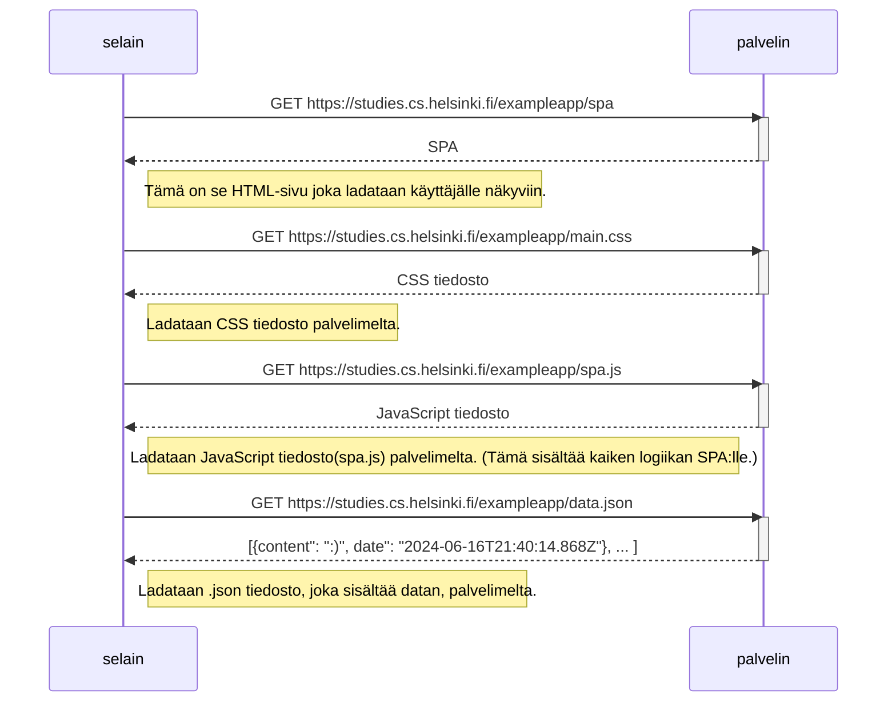

```mermaid
sequenceDiagram
    participant selain
    participant palvelin

    selain->>palvelin: GET https://studies.cs.helsinki.fi/exampleapp/spa
    activate palvelin
    palvelin-->>selain: SPA
    deactivate palvelin
    Note right of selain: Tämä on se HTML-sivu joka ladataan käyttäjälle näkyviin.

    selain->>palvelin: GET https://studies.cs.helsinki.fi/exampleapp/main.css
    activate palvelin
    palvelin-->>selain: CSS tiedosto
    deactivate palvelin
    Note right of selain: Ladataan CSS tiedosto palvelimelta.

    selain->>palvelin: GET https://studies.cs.helsinki.fi/exampleapp/spa.js
    activate palvelin
    palvelin-->>selain: JavaScript tiedosto
    deactivate palvelin
    Note right of selain: Ladataan JavaScript tiedosto(spa.js) palvelimelta. (Tämä sisältää kaiken logiikan SPA:lle.)
    
    selain->>palvelin: GET https://studies.cs.helsinki.fi/exampleapp/data.json
    activate palvelin
    palvelin-->>selain: [{content": ":)", date": "2024-06-16T21:40:14.868Z"}, ... ]
    deactivate palvelin
    Note right of selain: Ladataan .json tiedosto, joka sisältää datan, palvelimelta.
```
