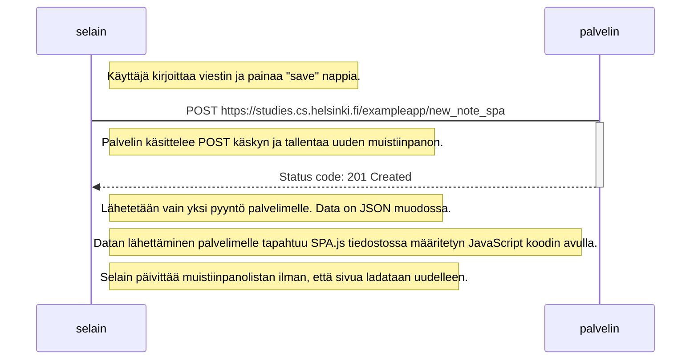

```mermaid
sequenceDiagram
    participant selain
    participant palvelin

    Note right of selain: Käyttäjä kirjoittaa viestin ja painaa "save" nappia.


    selain-> palvelin: POST https://studies.cs.helsinki.fi/exampleapp/new_note_spa
    activate palvelin
    Note right of selain: Palvelin käsittelee POST käskyn ja tallentaa uuden muistiinpanon.
    palvelin-->>selain: Status code: 201 Created
    deactivate palvelin
    Note right of selain: Lähetetään vain yksi pyyntö palvelimelle. Data on JSON muodossa.
    Note right of selain: Datan lähettäminen palvelimelle tapahtuu SPA.js tiedostossa määritetyn JavaScript koodin avulla.
    Note Right of selain: Selain päivittää muistiinpanolistan ilman, että sivua ladataan uudelleen.
```
